# Arquitectura Hardware: Acelerador de Alice en FPGA

> **Dispositivo FPGA**: Digilent Nexys Video — Xilinx Artix-7 `XC7A200T-1SBG484C`  
> **Frecuencia de Operación**: $25.000\text{ MHz}$ ($T_{\text{clk}} = 40.00\text{ ns}$)  
> **Controlador Embebido**: Procesador Softcore MicroBlaze (32 bits, v11.0)  
> **Interfaces**: AXI4-Lite Slave (Control y Telemetría), AXI4-Stream (Ingesta X/m)  

---

## 🏛️ Diagrama de Bloques de la Arquitectura

```mermaid
graph TD
    subgraph Host_PC["Host PC (Control & Monitoreo)"]
        PYTHON["tools/run_board.py alice"]
        XSDB["Xilinx XSDB (JTAG)"]
    end

    subgraph Nexys_Video["FPGA Artix-7 XC7A200T (Alice)"]
        MB["MicroBlaze Softcore<br>(25 MHz)"]
        UART_IP["AXI UARTlite<br>(9600 bps)"]
        
        subgraph AXI_Wrapper["cvqkd_alice_axi_wrapper"]
            REG_CTRL["REG_CTRL<br>(0x00)"]
            REG_STATUS["REG_STATUS<br>(0x04) [Iter Telemetry]"]
            REG_K["REG_K_FACTOR / MODE<br>(0x08, 0x0C)"]
            SYN_BRAM["syn_bram<br>(552 words x 32b)"]
            KEY_BRAM["key_bram<br>(816 words x 32b)"]
            
            FSM_TOP["FSM Maestra de Control<br>(ST_IDLE, ST_LOAD_SYN, ST_RUN, ST_EXTRACT)"]
        end

        subgraph Core_Alice["alice_post_processing_core"]
            RAM_X["ram_x (3264x128b)"]
            RAM_M["ram_m (3264x256b)"]
            RAM_K["ram_k (3264x32b)"]
            
            MDR["mdr_alice_top<br>(8 DSP48E1 MAC)"]
            ADAPTER["Adaptador S2P<br>(8b -> 3072b)"]
            
            subgraph LDPC["ldpc_decoder_top"]
                FSM_LDPC["ldpc_controller_fsm<br>(Layered Controller)"]
                DATAPATH["ldpc_layer_datapath<br>(384 VNUs en Paralelo)"]
                CNU["384 CNUs Seriales"]
                SHIFTER["barrel_shifter (Z=384)"]
                SYN_CHK["syndrome_checker<br>(Early Stopping)"]
                L_BRAM["L_BRAM (68x3072b)"]
                R_BRAM["R_BRAM (316x3072b)"]
            end
        end
    end

    PYTHON -->|USB-UART| UART_IP
    XSDB -->|JTAG FT2232H| MB
    UART_IP <-->|AXI-Lite| MB
    MB <-->|AXI-Lite| AXI_Wrapper
    FSM_TOP --> Core_Alice
    MDR -->|LLRs 8 bits| ADAPTER
    ADAPTER -->|Bus 3072 bits| L_BRAM
    L_BRAM -->|Clave Extraída| KEY_BRAM
```

---

## 🧩 Descripción de Módulos Principales

### 1. `cvqkd_alice_axi_wrapper.v`
- Proporciona la interfaz esclava AXI4-Lite de 32 bits hacia el MicroBlaze. Es Verilog-2001 porque Vivado solo admite Verilog o VHDL como top de una referencia a módulo (el resto del diseño es SystemVerilog).
- Contiene los registros de control, estado y las memorias intermedias accesibles por el procesador.
- Las memorias `ram_x`, `ram_m`, `ram_k` y `syn_bram` se inicializan en síntesis con los vectores de MATLAB (`$readmemh` por nombre de fichero; `create_alice_project.tcl` los añade como *Memory Initialization Files*). La placa solo tiene 16 KB de memoria local para el MicroBlaze, así que la trama de prueba va precargada en el bitstream.
- Los receptores AXI4-Stream `s_axis_x` y `s_axis_m` permiten cargar tramas nuevas por DMA, pero en este diseño los dos AXI DMA no tienen memoria de origen (no hay DDR): el firmware usa la trama precargada.
- Cuenta los ciclos de reloj de cada ejecución (registro `0x18`): el firmware calcula con él la latencia real.
- Gobierna la carga de las 46 filas de síndrome de Bob hacia el decodificador ($552\text{ ciclos}$).
- Extrae la clave decodificada desde `L_BRAM` hacia `key_bram` en 816 ciclos tras la señal de éxito.

### 2. `alice_post_processing_core.sv`
- Subsistema top-level de procesamiento cuántico de Alice.
- Integra el motor MDR y el decodificador LDPC, gestionando el handshake entre ambos bloques.

### 3. `mdr_alice_top.sv`
- Realiza el cálculo de reconciliación multidimensional en 8 dimensiones.
- Desempaqueta las coordenadas crudas $X$ (16 bits), los mensajes $m$ (Q24) y la constante de canal $K$ (Q10).
- Incorpora un banco de **8 multiplicadores DSP48E1 canalizados**, calculando 1 coordenada de LLR cada ciclo de reloj con acumulación en árbol de sumadores.

### 4. `ldpc_decoder_top.sv`
- Decodificador Quasi-Cíclico 5G-NR Base Graph 1 ($46 \times 68$).
- Opera con un ancho de banda interno colosal: un bus de **3.072 bits** ($384 \times 8\text{ bits}$ de signo y magnitud).
- Implementa el algoritmo **Layered Min-Sum** con terminación anticipada garantizada por `syndrome_checker.sv`.
- Incorpora la optimización de anulación `is_first_iter` para permitir streaming continuo sin retención de estado inter-trama en `R_BRAM`.
